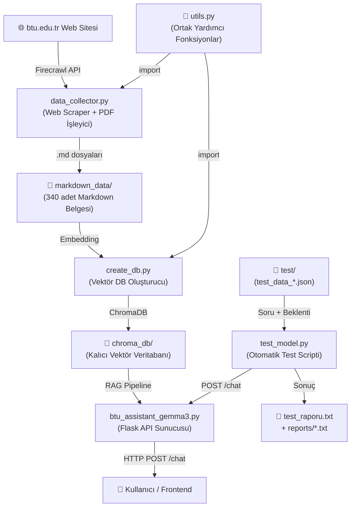
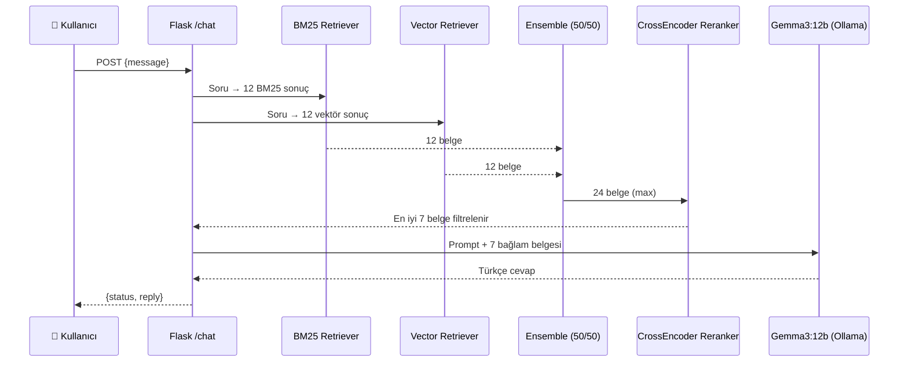
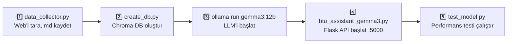

# 📚 BTU-AI-ASSISTANT — Detaylı Proje Raporu

> **Proje Yolu:** `f:\Github Repo\BTU-AI-ASSISTANT\server`  
> **Rapor Tarihi:** 15 Mart 2026

---

## 🏗️ Genel Proje Mimarisi



Proje, Bursa Teknik Üniversitesi (BTÜ) öğrenci ve personeline yönelik **yerelde çalışan (on-premise) bir RAG (Retrieval-Augmented Generation) asistanıdır.** Gecikme olmadan çalışmak için Ollama üzerinden lokal LLM kullanır.

---

## 📁 Dosya Dosya İnceleme

---

### 1. [data_collector.py](file:///f:/Github%20Repo/BTU-AI-ASSISTANT/server/data_collector.py) — Web Tarayıcısı ve Veri Toplayıcı

**Boyut:** 15.050 byte | **Satır:** 370

**Amaç:** BTÜ web sitesini (btu.edu.tr) baştan sona tarayıp tüm sayfaları ve PDF belgelerini Markdown formatında `markdown_data/` klasörüne kaydeder.

#### Temel Akış

| Adım | İşlem                                                                                                              |
| ---- | ------------------------------------------------------------------------------------------------------------------ |
| 1    | [visited_urls.json](file:///f:/Github%20Repo/BTU-AI-ASSISTANT/server/visited_urls.json)'dan geçmiş hafıza yüklenir |
| 2    | Firecrawl API ile her URL scrape edilir                                                                            |
| 3    | Linkler çıkarılır, kuyruk dinamik olarak büyütülür                                                                 |
| 4    | İçerik kalitesi denetlenerek metin temizlenir                                                                      |
| 5    | PDF linkleri tespit edilip PDF metni çıkarılır                                                                     |
| 6    | Her belge `markdown_data/{başlık}_{hash8}.md` olarak kaydedilir                                                    |
| 7    | Son aşamada `knowledge_base.json` derlenir                                                                         |

#### Önemli Sabitler

```python
TARGET_URL     = 'https://www.btu.edu.tr/'
OUTPUT_DIR     = "markdown_data"
VISITED_URLS_FILE = "visited_urls.json"
```

#### Akıllı Özellikler

- **İngilizce sayfa filtresi:** `/en/` veya `/en` içeren URL'ler otomatik atlanır
- **Tarih filtresi:** 2025 veya 2026 tarihli olmayan duyuru/haberler [should_keep_content()](file:///f:/Github%20Repo/BTU-AI-ASSISTANT/server/utils.py#197-221) sayesinde atlanır
- **Hızlı link tarama:** Ziyaret edilmiş URL'lerin içindeki yeni linkleri hafif `requests.get()` ile bulur (Firecrawl kredisi harcamadan)
- **Kota koruma:** Firecrawl 429/401/quota hatası alındığında döngü durur ve PDF aşamasına geçilir
- **PDF AI temizleme:** Tablo/ücret/takvim içeren PDF'ler Gemini AI ile temizlenir
- **Manuel PDF listesi:** 3 adet özel akademik takvim PDF'i sabit liste ile zorla işlenir

---

### 2. [utils.py](file:///f:/Github%20Repo/BTU-AI-ASSISTANT/server/utils.py) — Ortak Yardımcı Kütüphane

**Boyut:** 10.473 byte | **Satır:** 244

**Amaç:** [data_collector.py](file:///f:/Github%20Repo/BTU-AI-ASSISTANT/server/data_collector.py) tarafından import edilen yardımcı fonksiyon ve sabitlerin deposu.

#### Öne Çıkan Bileşenler

**`YASAKLI_KELIMELER` listesi:**  
Görsel, arşiv, giriş sayfası, bütçe, ihale, etkinlik gibi 30+ yanlış pozitif tetikleyici içeren URL'leri filtreler.

**[advanced_clean_text(text)](file:///f:/Github%20Repo/BTU-AI-ASSISTANT/server/utils.py#49-112):**

- Markdown görselleri, breadcrumb menüleri ve takvim gürültüsünü temizler
- `seen` seti ile tekrar eden satırları kaldırır
- Satır atlamalarını korurken fazla boşlukları normalize eder

**[extract_text_from_pdf(pdf_url)](file:///f:/Github%20Repo/BTU-AI-ASSISTANT/server/utils.py#157-192):**

- Önce `pdfplumber` ile metin çıkarmayı dener
- Başarısız olursa `pypdf` (`PdfReader`) fallback olarak devreye girer
- `m2/m²` sayısını kontrol ederek kroki/plan PDF'leri atar

**[clean_complex_content_with_llm(raw_content, url)](file:///f:/Github%20Repo/BTU-AI-ASSISTANT/server/utils.py#222-245):**

- Karmaşık tablo veya ücret listesi içeren metinleri **Google Gemini 1.5 Flash** ile düzenler
- 3 deneme hakkı tanır, ağ hatasında 30 sn bekler

**[should_keep_content(url, content)](file:///f:/Github%20Repo/BTU-AI-ASSISTANT/server/utils.py#197-221):**

- Evergreen (ders/bölüm/akademik) sayfaları her zaman tutar
- Duyuru/haber sayfalarında 2025-2026 tarih kontrolü yapar

---

### 3. [create_db.py](file:///f:/Github%20Repo/BTU-AI-ASSISTANT/server/create_db.py) — Vektör Veritabanı Oluşturucu

**Boyut:** 6.534 byte | **Satır:** 167

**Amaç:** `markdown_data/` klasöründeki tüm [.md](file:///f:/Github%20Repo/BTU-AI-ASSISTANT/server/markdown_data/doc_0a600756.md) dosyalarını okuyup Chroma vektör veritabanına dönüştürür.

#### Temel Parametreler

| Parametre        | Değer                                                                                |
| ---------------- | ------------------------------------------------------------------------------------ |
| Embedding Modeli | `sentence-transformers/paraphrase-multilingual-MiniLM-L12-v2`                        |
| Chunk Boyutu     | 800 karakter                                                                         |
| Chunk Örtüşmesi  | 150 karakter                                                                         |
| Ayırıcılar       | `\n\n`, `# `, `\n`, `.`, ` `, `""`                                                   |
| Chroma DB Yolu   | [./chroma_db](file:///f:/Github%20Repo/BTU-AI-ASSISTANT/server/create_db.py#107-164) |

#### Çalışma Adımları

1. **Eski DB temizleme** — `shutil.rmtree(CHROMA_PATH)`
2. **Embedding modeli yükleme** — HuggingFace multilingual model
3. **Markdown okuma** — Frontmatter (YAML başlık) ayrıştırılır; title, source, type, category çıkarılır
4. **Chunking** — `RecursiveCharacterTextSplitter` ile parçalama
5. **Bağlam aşılama** _(kritik adım)_ — Her chunk'ın başına `[KAYNAK BELGE: X | İLGİLİ BİRİM: Y]` etiketi eklenir
6. **Chroma'ya kayıt** — Vektörler hesaplanıp diske yazılır

**[get_department_from_url(url)](file:///f:/Github%20Repo/BTU-AI-ASSISTANT/server/create_db.py#20-47):** URL desenine bakarak belgenin hangi birime ait olduğunu tespit eder:

```
/bidb/   → Bilgi İşlem Daire Başkanlığı
/sks/    → Sağlık, Kültür ve Spor Daire Başkanlığı
/kutuphane/ → Kütüphane
/erasmus → Erasmus Koordinatörlüğü
...vb.
```

---

### 4. [btu_assistant_gemma3.py](file:///f:/Github%20Repo/BTU-AI-ASSISTANT/server/btu_assistant_gemma3.py) — Ana RAG Asistanı (Flask API)

**Boyut:** 8.465 byte | **Satır:** 186

**Amaç:** RAG pipeline'ını kurar ve `POST /chat` uç noktasını sunar.

#### Sistem Parametreleri

| Bileşen        | Değer                                   |
| -------------- | --------------------------------------- |
| LLM            | `gemma3:12b` (Ollama üzerinden lokal)   |
| Embedding      | `paraphrase-multilingual-MiniLM-L12-v2` |
| Reranker       | `BAAI/bge-reranker-v2-m3` (çok dilli)   |
| BM25 K         | 12                                      |
| Vektör K       | 12                                      |
| Reranker Top-N | 7                                       |
| Flask Port     | 5000                                    |

#### RAG Mimarisi (6 Adımlı)



#### Sistem Promptu Kuralları

1. Sadece sağlanan bağlamı kullan (halüsinasyon yasak)
2. Cevap bulunamazsa "bulamadım" de
3. Listeli sayımlarda cevabı kendin hesapla
4. Her cevabın sonuna kaynak URL ekle
5. Markdown formatında, temiz çıktı ver

#### API Endpoint

```
POST http://0.0.0.0:5000/chat
Content-Type: application/json

{"message": "Kütüphanede kaç bilgisayar var?"}
```

```json
{ "status": "success", "reply": "BTÜ kütüphanesinde 30 adet masaüstü..." }
```

---

### 5. [test_model.py](file:///f:/Github%20Repo/BTU-AI-ASSISTANT/server/test_model.py) — Otomatik Performans Test Scripti

**Boyut:** 6.906 byte | **Satır:** 157

**Amaç:** [test/test_data_all.json](file:///f:/Github%20Repo/BTU-AI-ASSISTANT/server/test/test_data_all.json) içindeki soruları API'ye gönderip 4 metriği ölçer ve rapor üretir.

#### Ölçülen Metrikler

| Metrik                | Hedef |
| --------------------- | ----- |
| Kaynak Gösterme Oranı | > %90 |
| Doğruluk Oranı        | > %85 |
| Halüsinasyon Oranı    | < %15 |
| Ortalama Yanıt Süresi | —     |

#### Akıllı Eşleştirme Algoritması

[metin_normalize_et()](file:///f:/Github%20Repo/BTU-AI-ASSISTANT/server/test_model.py#17-40) fonksiyonu:

- Türkçe büyük harf dönüşümü (`İ→i`, `I→ı`)
- Noktalama temizliği
- Çoklu boşluk sıkıştırma

**OR mantığı** ile alternatif cevaplar desteklenir:

```json
"beklenen_kelimeler": ["katkı payı alınmaz|muaftır|muafdır|ödemez|ücretsizdir"]
```

**Çıktı:** [test_raporu.txt](file:///f:/Github%20Repo/BTU-AI-ASSISTANT/server/test_raporu.txt) ve `reports/` klasörüne `test_raporu_*.txt`

---

## 📂 Dizin ve Dosya Yapısı

```
server/
├── 🐍 btu_assistant_gemma3.py   # Ana Flask API & RAG pipeline
├── 🐍 create_db.py              # Chroma vektör DB oluşturucu
├── 🐍 data_collector.py         # Web scraper & veri toplayıcı
├── 🐍 utils.py                  # Ortak yardımcı fonksiyonlar
├── 🐍 test_model.py             # Otomatik test & metrik scripti
│
├── 📋 requirements.txt          # ~150 Python bağımlılığı
├── 🔐 .env                      # API anahtarları (FIRECRAWL_KEY, GOOGLE_API_KEY)
├── 🚫 .gitignore
│
├── 📂 markdown_data/            # 340 adet .md belgesi (BTÜ içerikleri)
├── 📂 chroma_db/                # Kalıcı ChromaDB vektör dosyaları
├── 📂 test/                     # Test veri setleri
│   ├── test_data_1.json         # 10 soru (Set 1)
│   ├── test_data_2.json         # 10 soru (Set 2)
│   ├── test_data_3.json         # 10 soru (Set 3)
│   ├── test_data_4.json         # 10 soru (Set 4)
│   ├── test_data_5.json         # 10 soru (Set 5)
│   └── test_data_all.json       # 50 soru (Tüm setler birleşik)
├── 📂 reports/                  # Test raporları (set bazında)
│   ├── test_raporu_1.txt ~ 5.txt
│   └── test_raporu_all.txt
│
├── 📄 test_raporu.txt           # Son test çalıştırması raporu
└── 📄 visited_urls.json         # 1000+ taranmış URL hafızası
```

---

## 📦 Bağımlılıklar (requirements.txt)

~150 paket. Kritik olanlar:

| Kategori                 | Paket(ler)                                                                                                                                                 |
| ------------------------ | ---------------------------------------------------------------------------------------------------------------------------------------------------------- |
| **LangChain Ekosistemi** | `langchain==1.2.11`, `langchain-chroma`, `langchain-classic`, `langchain-community`, `langchain-huggingface`, `langchain-ollama`, `langchain-google-genai` |
| **LLM / Embedding**      | `sentence-transformers==5.2.2`, `transformers==4.57.6`, `torch==2.10.0`                                                                                    |
| **Vektör DB**            | `chromadb==1.5.0`                                                                                                                                          |
| **Reranker**             | `FlashRank==0.2.10`                                                                                                                                        |
| **BM25**                 | `rank-bm25==0.2.2`                                                                                                                                         |
| **PDF İşleme**           | `pypdf==6.7.0`, `pdfplumber==0.11.9`                                                                                                                       |
| **Web Scraping**         | `firecrawl-py==4.14.1`, `requests==2.32.5`, `beautifulsoup4`                                                                                               |
| **API Sunucu**           | `Flask==3.1.2`, `flask-cors==6.0.2`                                                                                                                        |
| **AI API**               | `google-generativeai==0.8.6`, `google-genai==1.63.0`                                                                                                       |
| **Çevre**                | `python-dotenv==1.2.1`                                                                                                                                     |

---

## 🧪 Test Veri Seti Özeti ([test_data_all.json](file:///f:/Github%20Repo/BTU-AI-ASSISTANT/server/test/test_data_all.json))

50 soru, 5 set halinde organize edilmiştir:

| Set | Dosya                                                                                      | İçerik                                                             |
| --- | ------------------------------------------------------------------------------------------ | ------------------------------------------------------------------ |
| 1   | [test_data_1.json](file:///f:/Github%20Repo/BTU-AI-ASSISTANT/server/test/test_data_1.json) | Kütüphane (bilgisayar, gecikme cezası, ayırtma), Bursiyer hakları  |
| 2   | [test_data_2.json](file:///f:/Github%20Repo/BTU-AI-ASSISTANT/server/test/test_data_2.json) | Ders kaydı SSS, e-posta formatı, AGNO limitleri                    |
| 3   | [test_data_3.json](file:///f:/Github%20Repo/BTU-AI-ASSISTANT/server/test/test_data_3.json) | Yemekhane saatleri, sağlık birimi, revir, PDR                      |
| 4   | [test_data_4.json](file:///f:/Github%20Repo/BTU-AI-ASSISTANT/server/test/test_data_4.json) | Erasmus başvurusu, Eduroam, Turnitin, MERLAB                       |
| 5   | [test_data_5.json](file:///f:/Github%20Repo/BTU-AI-ASSISTANT/server/test/test_data_5.json) | Akademik istatistikler (öğrenci/personel sayısı), spor turnuvaları |

#### Kapsanan Konular

- Kütüphane kuralları & ödünç
- Ders kayıt ve burs sistemi
- Sağlık, beslenme ve spor hizmetleri
- Akademik sayısal veriler
- Erasmus, değişim programları
- Benzerlik tespit yazılımları
- Bölüm kontenjanları ve sıralamalar

---

## 🔄 Tam Çalışma Sırası



---

## 💡 Tasarım Kararları ve Notlar

| Karar                                   | Gerekçe                                                                                                                                                           |
| --------------------------------------- | ----------------------------------------------------------------------------------------------------------------------------------------------------------------- | ------------------------------------------------------------------------------ |
| **Hibrit Retrieval (BM25 + Vektör)**    | Tam kelime eşleşmesi (BM25) + anlam arama (vektör) birlikte kullanılarak recall artırılmış                                                                        |
| **CrossEncoder Reranker**               | 24 adaydan en iyi 7'yi seçerek LLM'e gönderilen bağlamın kalitesi artırılmış                                                                                      |
| **Lokal LLM (Ollama Gemma3:12b)**       | Veri gizliliği ve çevrimdışı kullanılabilirlik için cloud API yerine lokaldefterler tercih edilmiş                                                                |
| **Google Gemini (Sadece veri toplama)** | Karmaşık PDF tablolarını temizlemek için yalnızca [data_collector.py](file:///f:/Github%20Repo/BTU-AI-ASSISTANT/server/data_collector.py) aşamasında kullanılıyor |
| **Chunk'a Bağlam Etiketi ekleme**       | `[KAYNAK BELGE: X                                                                                                                                                 | İLGİLİ BİRİM: Y]` etiketi retrieval kalitesini ve kaynak doğruluğunu artırıyor |
| **OR mantığı test eşleştirmede**        | `"muaftır\|muafdır\|ödemez"` gibi varyasyonlar sayesinde anlam doğruyken teknik hata sayılmıyor                                                                   |
